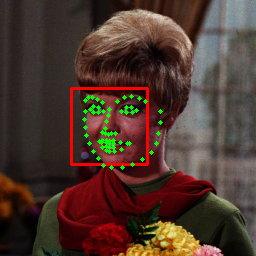

<hr>

1. [環境の設定](README.md)
2. [基本概要](BASIC_00.md)
3. [カメラへのアクセスと動画処理](BASIC_01.md)
4. 顔と顔パーツの検出（↓）
5. [顔・手・ポーズ検出](BASIC_03.md)
6. [各種クラス・応用](BASIC_04.md)


<hr>

# 顔検出
  ## 準備
  __※配布環境を使用している場合， learned_models.zip をダウンロードして解凍し，learned_modelsフォルダをソースコードフォルダ（py24）に配置してください．__<br>
  <!--
  __※配布環境を使用している場合，以下の作業は不要です．__<br>
  dlibはpipでインストール可能だが， *setup.py* が走るので，Cコンパイラ環境とcmakeが必要です．<br>
  [Visual Studio Community (無償版)](https://visualstudio.microsoft.com/ja/free-developer-offers/) のVisual C++アプリケーションのインストールを事前に行っておきましょう．

  ```sh
  % pip insall cmake
  % pip install dlib
  ```

   - [OpenCVのHaar Cascadeの学習済みサンプルへのリンク](https://github.com/opencv/opencv/tree/master/data/haarcascades)
   - [dlibの学習済みサンプル等へのリンク](http://dlib.net/files/)
   - [OpenCV FaceMark APIの説明へのリンク](https://docs.opencv.org/4.x/d7/dec/tutorial_facemark_usage.html)

  それぞれDLして解凍し，スクリプトと同じフォルダに配置しておきます．
  -->
  ## Haar-like特徴量を用いた顔検出
  Haar-like特徴量（矩形領域の濃淡パターン）を使った顔検出です．OpenCVではHaar-like特徴を用いた分類器が配布されています．<br>
  下記サンプルは，静止画像に対する人の正面顔（haarcascade_frontalface_default.xml）と検出した顔領域の中から目領域（haarcascade_eye.xml）を検出する例です．
  
  ```python
  import cv2

  mdl_folder = "./learned_models/"  # 学習済みファイルのまでのパス
  img_folder = "./image/standard/" # 画像ファイルまでのパス

  def main():
    face_cascade = cv2.CascadeClassifier(mdl_folder + "haarcascades/haarcascade_frontalface_default.xml")
    eye_cascade = cv2.CascadeClassifier(mdl_folder + "haarcascades/haarcascade_eye.xml")
    img  = cv2.imread(img_folder + "Girl.bmp")
    gray = cv2.cvtColor(img, cv2.COLOR_BGR2GRAY)

    ######## 顔の検出 ########
    # カスケードを10%ずつ縮小しながら検出，最低何個の近傍矩形を検出すれば採用するか
    faces = face_cascade.detectMultiScale(gray, 1.1, 5)

    # facesの中にある顔と認識した領域を順に取り出す
    for (x, y, w, h) in faces:
      cv2.rectangle(img, (x, y), (x+w, y+h), (0, 0, 255), 2)
      ######## 顔の中から眼を検出 ########
      face_gray  = gray[y:y+h, x:x+w]

      eyes = eye_cascade.detectMultiScale(face_gray)
      for (ex, ey, ew, eh) in eyes:
        cv2.rectangle(img, (x+ex, y+ey), (x+ex+ew, y+ey+eh), (255, 0, 0), 1)

      cv2.imshow("haar-like", img)

    cv2.waitKey(0)
    cv2.destroyAllWindows()

  if __name__ == '__main__':
    main()
  ``` 

 | 元画像 | 検出結果 |
 |:-- |:-- |
 |  |  |
 
  ## LBF（Local Binary Features）を用いた顔パーツ検出
  Local Binary Features（輝度値の差分情報）を使った顔パーツ検出です．<br>
  下記サンプルは，静止画像に対してHaar-likeによる人の正面顔検出の後，顔パーツ検出を行い，検出した頂点（ランドマーク）を描画する例です．<br>
  メソッドはOpenCVのFaceMark APIに標準実装されており，学習済みファイルには lbfmodel.yaml を利用します．
  
  ```python
  import cv2
  import numpy as np

  mdl_folder = "./learned_models/"  # 学習済みファイルのまでのパス
  img_folder = "./image/standard/" # 画像ファイルまでのパス

  def main():
    face_cascade = cv2.CascadeClassifier(mdl_folder + "haarcascades/haarcascade_frontalface_default.xml")
    fmdetector = cv2.face.createFacemarkLBF()
    fmdetector.loadModel(mdl_folder + "lbfmodel.yaml")
    img = cv2.imread(img_folder + "Girl.bmp")
    gray = cv2.cvtColor(img, cv2.COLOR_BGR2GRAY)

    ######## 顔の検出 ########
    # カスケードを10%ずつ縮小しながら検出，最低何個の近傍矩形を検出すれば採用するか
    faces = face_cascade.detectMultiScale(gray, 1.1, 5)

    # facesの中にある顔と認識した領域を順に取り出す
    for face in faces:
      [x, y, w, h] = face
      cv2.rectangle(img, (x, y), (x+w, y+h), (0, 0, 255), 2)

      ######## 顔の中から68点の顔の特徴点を検出 ########
      landmarks = fmdetector.fit(img, np.array([face]))
      _, list = landmarks
      parts = np.array(list[0][0], dtype=np.int32) # parts[0]～[67]にランドマークの頂点座標が格納されている

      for i, point in enumerate(parts): # parts[i][0]にx，parts[i][1]にy
        cv2.circle(img, (point[0], point[1]), 2,(0,255, 0), -1)

    cv2.imshow("LBF", img)

    cv2.waitKey(0)
    cv2.destroyAllWindows()

  if __name__ == '__main__':
    main()
  ```
 | 検出結果 |
 |:-- |
 |  |

  ## dlib を用いた顔パーツ検出
  dlib C++ Libraryに実装されたアルゴリズム（ [KAZEMIによる論文, CVPR 2014](https://openaccess.thecvf.com/content_cvpr_2014/html/Kazemi_One_Millisecond_Face_2014_CVPR_paper.html) ）を使った顔と顔パーツ検出です．<br>
  学習済みファイルには shape_predictor_68_face_landmarks.dat を利用します．なお，顔パーツの型変換のために imutils ライブラリ（*）を利用しています．
  - ランドマークの0-67の添字はインターネットの情報などを参考にしてください
  - 左右の目の両端と鼻の5点をランドマークとする shape_predictor_5_face_landmarks.dat というファイルも配布されています

    > imutils ライブラリのインストールがない場合は以下の通りインストールしましょう．<br>
    > ```sh
    > > pip install imutils
    > ```


  ```python
  import cv2
  import dlib
  from imutils import face_utils
  import numpy as np

  mdl_folder = "./learned_models/"  # 学習済みファイルのまでのパス
  img_folder = "./image/standard/" # 画像ファイルまでのパス

  def main():
    detector = dlib.get_frontal_face_detector()
    predictor = dlib.shape_predictor(mdl_folder+"shape_predictor_68_face_landmarks.dat")
    img = cv2.imread(img_folder + "Girl.bmp")

    # 顔の検出
    dets, scores, _ = detector.run(cv2.cvtColor(img, cv2.COLOR_BGR2RGB), 1)

    for i, face in enumerate(dets): # detsの中に四角形情報として検出された顔が順に格納
      [x, y, w, h] = [face.left(), face.top(), face.width(), face.height()]
      cv2.rectangle(img, (x, y), (x+w, y+h), (0, 0, 255), 2)

      # 顔の中から68点の顔の特徴点を検出
      parts = face_utils.shape_to_np(predictor(cv2.cvtColor(img, cv2.COLOR_BGR2RGB), face), dtype=np.int32)

      for j, point in enumerate(parts): # parts[i][0]にx，parts[i][1]にy
        cv2.circle(img, (point[0], point[1]), 2,(0,255, 0), -1)

    cv2.imshow("dlib", img)

    cv2.waitKey(0)
    cv2.destroyAllWindows()

  if __name__ == '__main__':
    main()

  ```
 | 検出結果 |
 |:-- |
 |  |

  ## [課題] カメラ（動画）からの顔・顔パーツ検出
  haar-like + lbf や dlib による顔・顔パーツ検出をカメラ映像へ適用するプログラムを作成してみましょう．
   - 学習済みモデルの読み込みは，フレームの読み込みのループの外で行います
   - 顔・顔パーツの検出対象を，画像ではなく，毎回読み込むフレームに変更します
  
  ## [課題] まばたきシャッター，スマイルシャッター
  顔パーツのうちで，上まぶたや下まぶた，口の両端を示すランドマークの番号を調べて，その位置の変化によってその時点のフレームを切り取るプログラムを作成してみましょう．
   - フレームの切り取りは[カメラへのアクセスと動画処理](BASIC_01.md) の章を確認してください

  <!--
  ## [エクストラ] 配布環境の自作ライブラリの利用
  配布環境には，OpenCV（Haar-likeとLBF），dlibなどによる顔・顔パーツ検出を補助するライブラリ（パッケージ）が用意してあります．
   - mylibs\\myPhysiology パッケージ内の cv_face_detector.py モジュール（Haar-likeとLBFを実装したcvFaceDetectorクラス）
   - mylibs\\myPhysiology パッケージ内の dlib_face_detector.py モジュール（dlibを実装したDlibFaceDetectorクラス）
   - CameraSelectorクラスの利用方法は [カメラへのアクセスと動画処理](BASIC_01.md) の章を確認してください

  ```python
  # -*- coding: utf-8 -*-
  import cv2
  import numpy as np
  import myCapture as mycap
  import myPhysiology as myphy
  import time

  dev = 0

  def main():
    cap = mycap.CameraSelector(dnum=dev, fps=30, size=[720, 1280])
    dlib = myphy.DlibFaceDetector() # OpenCVの場合 myphy.cvFaceDetector()

    while cap.isOpened():
      ret, fnum, frame = cap.read()

      if ret:
        ## Dlib and OpenCV Facemark API ######
        start = time.perf_counter()
        dets, _, _ = dlib.getFace(frame) # 顔の検出，cvの場合も引数とシグネチャは同じ

        if len(dets)>0:
          for i, face in enumerate(dets):
            cv2.rectangle(frame, (face[0], face[1]), (face[0]+face[2], face[1]+face[3]), [0, 0, 255], 1)

            parts = dlib.getFacemark_detection(frame, face) # 顔パーツの検出，cvの場合も引数とシグネチャは同じ
            for x,y in parts:
              cv2.circle(frame, (x,y), 3, [0, 255, 0], -1)

        cv2.imshow("video", frame)

      if cv2.waitKey(1) == ord('q'):
        break

    cap.release()
    cv2.destroyAllWindows()

  if __name__=='__main__':
    main()
  ```
  -->
