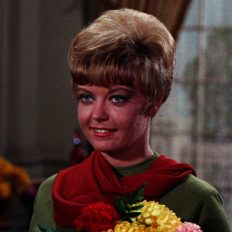
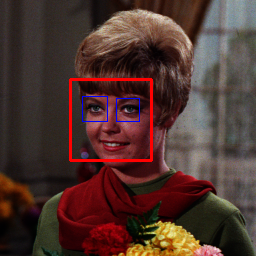
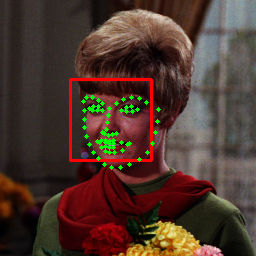

<hr>

1. [環境の設定](README.md)
2. [基本概要](BASIC_00.md)
3. [カメラへのアクセスと動画処理](BASIC_01.md)
4. 顔・手・ポーズ検出（↓）

<hr>

# 顔検出
  ## 準備
  __※配布環境を使用している場合は， .\\mylibs\\myPhysiology\\learned_model 以下に配置されているのでこの作業は不要です．__<br>
  dlibはpipでインストール可能だが， *setup.py* が走るので，Cコンパイラ環境とcmakeが必要です．<br>
  [Visual Studio Community (無償版)](https://visualstudio.microsoft.com/ja/free-developer-offers/) のVisual C++アプリケーションのインストールを事前に行っておきましょう．

  ```sh
  % pip insall cmake
  % pip install dlib
  ```

   - [OpenCVのHaar Cascadeの学習済みサンプルへのリンク](https://github.com/opencv/opencv/tree/master/data/haarcascades)
   - [dlibの学習済みサンプル等へのリンク](http://dlib.net/files/)
   - [OpenCV FaceMark APIの説明へのリンク](https://docs.opencv.org/4.x/d7/dec/tutorial_facemark_usage.html)

  それぞれDLして解凍し，スクリプトと同じフォルダに配置しておきます．

  ## Haar-like特徴量を用いた顔検出
  Haar-like特徴量（矩形領域の濃淡パターン）を使った顔検出です．OpenCVではHaar-like特徴を用いた分類器が配布されています．<br>
  下記サンプルは，静止画像に対する人の正面顔（haarcascade_frontalface_default.xml）と検出した顔領域の中から目領域（haarcascade_eye.xml）を検出する例です．
  
  ```python
  #-*- coding: utf-8 -*-
  import cv2

  mdl_folder = "mylibs/myPhysiology/learned_model/"  # 学習済みファイルのまでのパス
  img_folder = "img/" # 画像ファイルまでのパス

  def main():
    face_cascade = cv2.CascadeClassifier(mdl_folder + "haarcascades/haarcascade_frontalface_default.xml")
    eye_cascade = cv2.CascadeClassifier(mdl_folder + "haarcascades/haarcascade_eye.xml")
    img  = cv2.imread(img_folder + "Girl.bmp")
    gray = cv2.cvtColor(img, cv2.COLOR_BGR2GRAY)

    ######## 顔の検出 ########
    # カスケードを10%ずつ縮小しながら検出，最低何個の近傍矩形を検出すれば採用するか
    faces = face_cascade.detectMultiScale(gray, 1.1, 5)

    # facesの中にある顔と認識した領域を順に取り出す
    for (x, y, w, h) in faces:
      cv2.rectangle(img, (x, y), (x+w, y+h), (0, 0, 255), 2)
      ######## 顔の中から眼を検出 ########
      face_gray  = gray[y:y+h, x:x+w]

      eyes = eye_cascade.detectMultiScale(face_gray)
      for (ex, ey, ew, eh) in eyes:
        cv2.rectangle(img, (x+ex, y+ey), (x+ex+ew, y+ey+eh), (255, 0, 0), 1)

      cv2.imshow("haar-like", img)

    cv2.waitKey(0)
    cv2.destroyAllWindows()

  if __name__ == '__main__':
    main()
  ``` 

 | 元画像 | 検出結果 |
 |:-- |:-- |
 |  |  |
 
  ## LBF（Local Binary Features）を用いた顔パーツ検出
  Local Binary Features（輝度値の差分情報）を使った顔パーツ検出です．<br>
  下記サンプルは，静止画像に対してHaar-likeによる人の正面顔検出の後，顔パーツ検出を行い，検出した頂点（ランドマーク）を描画する例です．<br>
  メソッドはOpenCVのFaceMark APIに標準実装されており，学習済みファイルには lbfmodel.yaml を利用します．
  
  ```python
  #-*- coding: utf-8 -*-
  import cv2
  import numpy as np

  mdl_folder = "mylibs/myPhysiology/learned_model/"  # 学習済みファイルのまでのパス
  img_folder = "img/" # 画像ファイルまでのパス

  def main():
    face_cascade = cv2.CascadeClassifier(mdl_folder + "haarcascades/haarcascade_frontalface_default.xml")
    fmdetector = cv2.face.createFacemarkLBF()
    fmdetector.loadModel(mdl_folder + "lbfmodel.yaml")
    img = cv2.imread(img_folder + "Girl.bmp")
    gray = cv2.cvtColor(img, cv2.COLOR_BGR2GRAY)

    ######## 顔の検出 ########
    # カスケードを10%ずつ縮小しながら検出，最低何個の近傍矩形を検出すれば採用するか
    faces = face_cascade.detectMultiScale(gray, 1.1, 5)

    # facesの中にある顔と認識した領域を順に取り出す
    for face in faces:
      [x, y, w, h] = face
      cv2.rectangle(img, (x, y), (x+w, y+h), (0, 0, 255), 2)

      ######## 顔の中から68点の顔の特徴点を検出 ########
      landmarks = fmdetector.fit(img, np.array([face]))
      _, list = landmarks
      parts = np.array(list[0][0], dtype=np.int32) # parts[0]～[67]にランドマークの頂点座標が格納されている

      for i, point in enumerate(parts): # parts[i][0]にx，parts[i][1]にy
        cv2.circle(img, (point[0], point[1]), 2,(0,255, 0), -1)

    cv2.imshow("LBF", img)

    cv2.waitKey(0)
    cv2.destroyAllWindows()

  if __name__ == '__main__':
    main()
  ```
 | 検出結果 |
 |:-- |
 |  |
