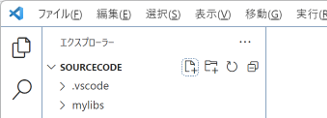
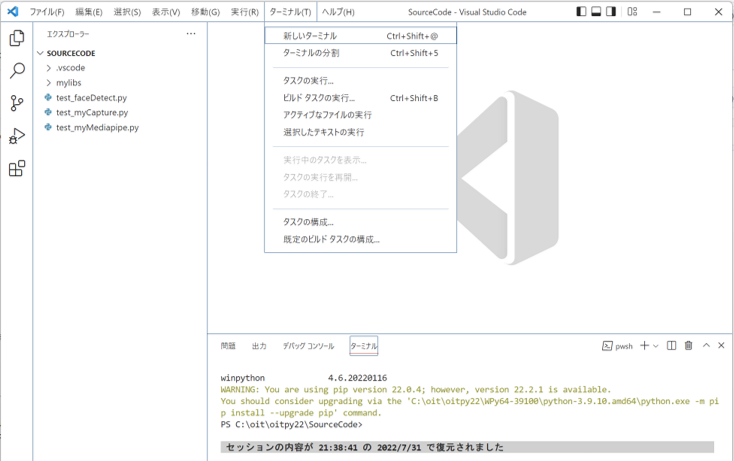
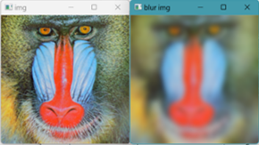

1. 環境の設定（↓）
2. [基本概要](BASIC_00.md)
3. [カメラへのアクセスと動画処理](BASIC_01.md)
4. [顔と顔パーツの検出](BASIC_02.md)
5. [顔・手・ポーズ検出](BASIC_03.md)
6. [各種クラス・応用](BASIC_04.md)

<hr>

# 環境のインストール

 - 以下は配布環境のインストール方法です

  0. 指定されたリンクから `pyXX.exe` をダウンロードします．
  > **Note** パスワードが必要な場合，大学のアカウントでのアクセスが必要な場合があるので注意しましょう
  1. `pyXX.exe` ファイルを実行します.
  > **Note** 以下のような警告画面が表示された場合, `詳細情報` をクリックした後，`実行` をクリックしてください. <br>
  > <image src="./inst00.png" width="40%" height="40%"><br>
  > <image src="./inst01.png" width="40%" height="40%"><br>
  2. `次へ(N)` をクリックします.<br>
  <image src="./inst02.png" width="40%" height="40%"><br>
  > インストール過程(1)...<br>
  > <image src="./inst03.png" width="40%" height="40%"><br>
  > インストール過程(2)...<br>
  > <image src="./inst04.png" width="40%" height="40%"><br>
  
  3. このインストーラでは， `C:\oit\pyXX` に python実行環境（Python3.X + VSCode) がインストールされ，ソースファイル ディレクトリとして `C:\oit\pyXX\source` と，デスクトップ上に実行のためのショートカット（下図）が設定されます．<br>
  <image src="./icon.png" width="10%" height="10%">

  > **Note** デスクトップへのショートカットの設定は，計算機の状況により失敗することがあります. その場合，`C:\oit\pyXX\pyXX_start.bat` をクリックして直接起動します．<br>
  > ショートカットを手動で作成することもできますが，`py25` フォルダ内のファイル（の一部）を **移動させない** ように注意しましょう．


# 環境の起動

  - デスクトップにあるpyXX_startのショートカットまたは C:\oit\pyXX\pyXX_start.bat をダブルクリックして起動します．

  - ソースコードディレクトリ構造
    - C:\oit\py25\source\以下のディレクトリ構造は次の通りです(2025/08)．新しい.pyファイルはsourceフォルダに追加します．
      ```
      +[source]           <== ワーキングディレクトリ ("C:\oit\py25")
      |
      |-+[img]            <== 画像用フォルダ
      | |-+[standard]     <== 標準画像用フォルダ
      |   |-+[mono]       <== グレースケール画像用フォルダ
      |   | |-(files)
      |   |-(files)
      |-+[learned_models] <== 学習済み物体・人検出ファイル格納フォルダ
      | |-+[haarcascades]
      | | |-(files)
      | |-+[mediapipe]
      | | |-(files)
      | |-(files)
      |-sample1.py
      |-sample2.py
      |-sample3.py
      |-sample4.py
      |-sample5.py
      |-sample6.py
      |-sample7.py
      |-sample8.py
      |-(files)
      ```

  ### :o:チェックポイント1
  - `py25en_start`の初回実行時に以下のポップアップが表示された場合， `親フォルダー \` \` 内のすべてのファイルの作成者を信頼します` をチェックし， `はい、作成者を信頼します` を選択します<br>
      <image src="./inst05.png" width="50%" height="50%">
  
  ### :o:チェックポイント2
  - VSCode起動時に `SOURCE`（`C:\oit\py25en\sorce\`）が開いていない場合，[ファイル]-[フォルダーを開く] メニューから開きます <br>
    <image src="./inst06.png" width="50%" height="50%">
  - VSCode起動時にターミナルウィンドウが開いていない場合,[…]-[ターミナル]-[新しいターミナル]メニューから開きます <br>
    <image src="./inst07.png" width="50%" height="50%">
  
  ### :o:チェックポイント3
  - VSCodeで `.py` ファイルを開いたときに, ステータスバー（右下）に `インタープリターを選択する`（`Select Python Interpreter`）と表示される場合 ...<br>
  - `インタープリターを選択する` をクリックし，コマンドパレットに `python.exe` (`C:\oit\py25en\WPy64-312101\python\python.exe`) までのパスを設定します<br>
    直接入力または `python.defaultInterpreterPath` の設定が候補にあればそれを選択します
    <image src="./inst08.png" width="50%" height="50%">
  - 正しく設定されたかは，ステータスバー（右下）に `python 3.12.10` と表示されているかを確認します
  
  ### :o:チェックポイント4
   - pythonの実行方法を確認しましょう
  
   1. [source] フォルダから `sample1.py` を開きます<br>
 
   > **Note** ターミナルウィンドウが開いていない場合は開くようにします（ [チェックポイント2](###チェックポイント2) を確認）<br> 
   > **Note** ターミナルウィンドウに表示されている現在の作業ディレクトリは実行するファイルの場所と同じである必要があります<br>
   > **Note** もしターミナルに表示されている現在のディレクトリがソースコードのディレクトリと異なる場合は `cd` コマンドを使ってディレクトリを変更する必要があります<br>
   <br>
   
   2. ターミナルウィンドウに下記のコマンドを入力して実行します
   
   ```sh
   C:\oit\py25\source> python sample1.py
   ```
   <br>
   
   > **Note** メニューにある `実行ボタン` からも実行は可能です <br>
   > <image src="./inst09.png"><br>
   <br>
   
   3. 以下の実行結果が得られれば成功です<br>
   <image src="./inst10.png"><br>

### :o: Practice
- Give it a try to run the ”hello_opencv.py”.
  - It is the sample of reading and showing an image file with the cv2 library.
  - The window is closed if any button is pressed.
- Give it a try to run the "show_video.py"
  - Create a new file" named "show_video.py"<br>
    <image src="../image/create_newfile.png" width="50%" height="50%"><br>
  - The following code is the sample of capturing from the camera and showing frames with the cv2 library.
    - Please copy & paste this code to "show_video.py".
    - The window is closed if \'q\' button is pressed.
    ```
    import cv2
    
    dev = 0
    
    def main():
        cap = cv2.VideoCapture(dev)
        ht = cap.get(cv2.CAP_PROP_FRAME_HEIGHT)
        wt = cap.get(cv2.CAP_PROP_FRAME_WIDTH)
        print(ht," x ", wt)
    
        while cap.isOpened():
            ret, frame = cap.read()
    
            if ret==False or cv2.waitKey(1) == ord('q'):
                break
    
            cv2.imshow("video", frame)
        
        cap.release()
        cv2.destroyAllWindows()
    
    if __name__=='__main__':
        main()
    ```
  
  > **Note** The latest usage of the Mediapipe is able to be learned in another section.

  <br>


1. exeファイルを展開します
    - C:\oit\py25\以下に，python，VS Codeが，<!-- C:\oit\home\以下にpy24フォルダ（ソースコード用フォルダ）-->が展開されます．
 
 
2. 環境の起動
    - デスクトップにあるpy25_startのショートカットまたは C:\oit\py25\py25_start.bat をダブルクリックして起動します．
 
 
3. ソースコードディレクトリ構造
    - C:\oit\py25\source\以下のディレクトリ構造は次の通りです．新しい.pyファイルはsourceフォルダに追加します．
      ```
      +[source]           <== ワーキングディレクトリ ("C:\oit\py25")
      |
      |-+[img]            <== 画像用フォルダ
      | |-+[standard]     <== 標準画像用フォルダ
      |   |-+[mono]       <== グレースケール画像用フォルダ
      |   | |-(files)
      |   |-(files)
      |-+[learned_models] <== 学習済み物体・人検出ファイル格納フォルダ
      | |-+[haarcascades]
      | | |-(files)
      | |-+[mediapipe]
      | | |-(files)
      | |-(files)
      |-sample1.py
      |-sample2.py
      |-sample3.py
      |-sample4.py
      |-sample5.py
      |-sample6.py
      |-sample7.py
      |-sample8.py
      |-(files)
      ```

4. 実行ファイルの作り方とターミナルの起動
    - VS Codeの[エクスプローラー]メニューの[SOURCE]フォルダの右に示される，新規ファイルの追加，新規フォルダの追加でファイルやフォルダの追加を行います．＊画像中の[SOURCECODE]を[SOURCE]に読み替えてください<br>
        
    - ターミナルが開いていない場合，[ターミナル]メニューから[新しいターミナル]を選択してターミナルを起動します．<br>
        

5. サンプルプログラムの実行
    - 新規ファイルとして[sample_basic.py]を作成し，以下のコードを入力してみましょう．
      ```python
      # sample_basic.py
      sum = 0
      for i in range(10):
        sum = sum + i
        print(str(i) + ":" + str(sum))
      if sum <= 30 :
        print("sum is under 30")
      elif sum <= 50 :
        print("sum is between 30 and 50")
      else:
        print("sum is over 50")
      ```
    - [実行] 以下のコマンドを入力するか，VS Code右上の再生ボタンを押してプログラムを実行します．<br>
      ※カレントディレクトリに注意
      ```sh
      python sample_basic.py
      ```
      
    - 以下の実行結果が出力されれば成功です．
      ```sh
      C:\oit\py25\source> python sample_basic.py
      0:0
      1:1
      2:3
      3:6
      4:10
      5:15
      6:21
      7:28
      8:36
      9:45
      sum is between 30 and 50
      ```

6. OpenCVライブラリのサンプルの実行
    - 新規ファイルとして[sample_cv2.py]を作成し，以下のコードを入力して実行してみましょう．
      ```python
      # sample_cv2.py
      import cv2
      img = cv2.imread('./img/standard/Mandrill.bmp') # read image file
      if img is None: # maybe Path is wrong
          print("image file is not opened.")
          exit(1)
      bimg = cv2.GaussianBlur(img, (51,51), 5) # gaussian filter (size=(51,51),sigma=5)
      cv2.imshow('img',img)
      cv2.imshow('blur img',bimg)
      cv2.waitKey(0) # pause until press any key
      cv2.destroyAllWindows # close all cv2's windows
      ```

    - 実行結果は以下の通りで， 2つ目のウィンドウは[Mandrill.bmp]をブラー（平滑化）した結果となります．<br>
        
